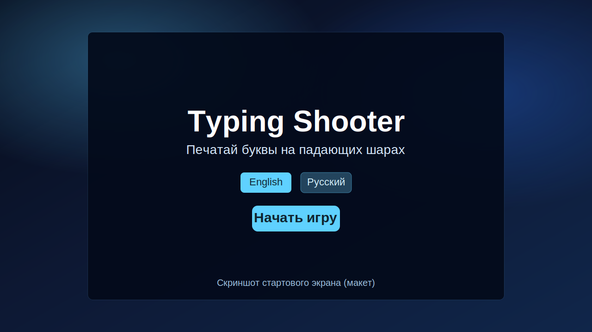

# Typing Shooter

Небольшая браузерная игра-тренажер слепой печати: на экране падают шары с символами, а игрок должен быстро нажимать соответствующие клавиши.



## Что есть в игре

- Стартовый экран с выбором набора символов: `English` или `Русский`.
- Плавное открытие новых символов по уровням (по 2 символа).
- Экран `Game Over` с кнопкой `Повторить`.
- Система очков, жизней и уровней.
- Частицы, эффект тряски и неоновый фон.

## Механика уровней

- Игра начинается с уровня `1`.
- На каждом следующем уровне добавляются новые символы.
- Уровень повышается по количеству успешных попаданий.
- Скорость падения адаптирована для более комфортного старта.

## Управление

- Нажимайте клавиши, которые видите на падающих шарах.
- Попадание по символу: шар лопается и добавляет очко.
- Если шар достиг низа экрана: теряется 1 жизнь.
- При `0` жизней показывается экран окончания игры.

## Запуск локально

Требования:

- `Node.js 18+`
- `npm`

Команды:

```bash
npm install
npm run dev
```

Сборка production:

```bash
npm run build
npm run preview
```

## Деплой на GitHub Pages

Проект уже содержит workflow для деплоя:

- `.github/workflows/deploy-pages.yml`

Чтобы опубликовать игру:

1. Запушьте код в ветку `main`.
2. В репозитории GitHub откройте `Settings -> Pages`.
3. В `Source` выберите `GitHub Actions`.
4. Дождитесь выполнения workflow `Deploy To GitHub Pages`.

## Технологии

- TypeScript
- Vite
- HTML5 Canvas
